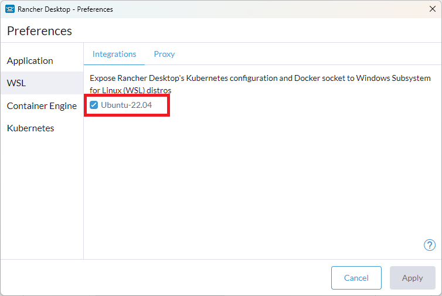
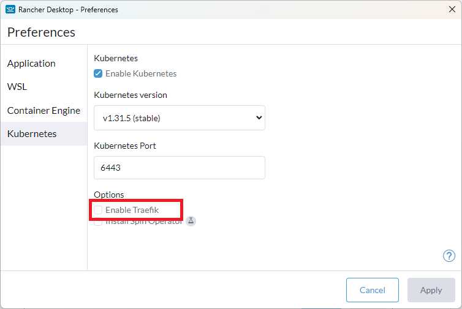
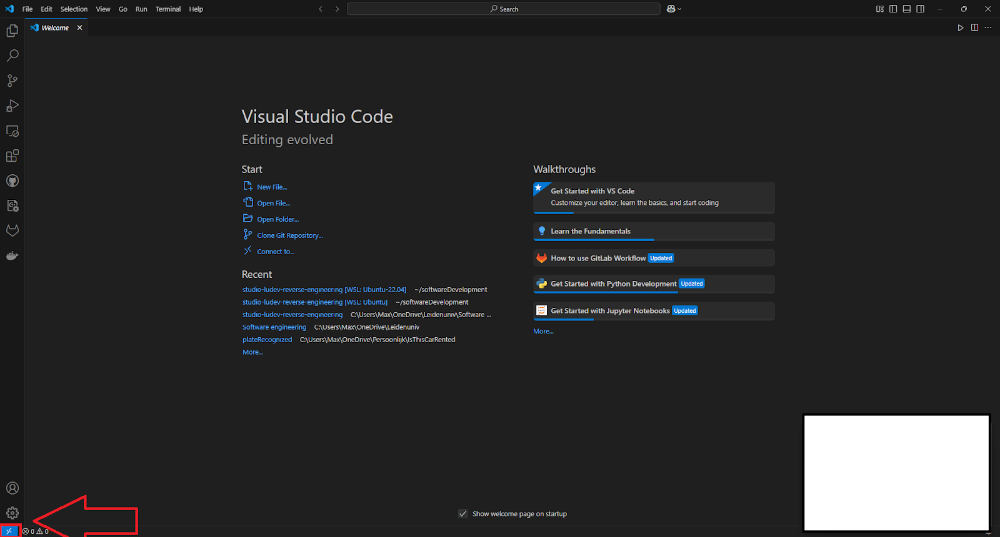

# Windows
This is guide to setup AI4MDE on Windows. If you have any components in this guide installed, verify you have selected the right options listed in this guide.

## 0. Prerequisites:
- Visual Studio Code installed.
- A docker account, Create one at https://hub.docker.com/ -> Sign up.
- Git installed.
# 1. Install WSL 2
- see: https://learn.microsoft.com/en-us/windows/wsl/install.

Ubuntu is preferred, but in theory each distro listed by wsl -l -o should be compatible. This claim is untested.

Open a Powershell terminal and type:
`wsl --install -d Ubuntu-22.04`
Complete the steps on screen.

Ubuntu 22.04 is installed, but in theory 24.04 should also work. This claim is untested, so use at your own risk :).
# 2. Install and setup Rancher desktop for windows
- see: https://rancherdesktop.io/

1. After installation, restart the computer.

2. Make sure that Rancher Desktop is connected to WSL. Go to “Preferences -> WSL” and select your distro:

And click “Apply”.

3. Make sure that “traefik” of Rancher Desktop is disabled. Go to “Preferences -> Kubernetes” and disable Traefik:

# 3. Connect to WSL inside Visual studio code
1. Press blue button on launch:

2. Press “Connect to WSL” and enter
3. Before cloning the repo, make sure Git doesn’t change end of line endings automatically. Do this by typing the following inside the terminal of your linux distro: `git config --global core.autocrlf false`
# 4. Clone the repository:
1. Go to Github repo, https://github.com/ai4mde/studio-ludev-reverse-engineering
2. Press <> Code (in green) and select HTTPS and copy the link
3. Open Visual Studio Code
4. type: Ctrl + Shift + P and type git: clone
5. paste the repo link we just copied.
6. Supply VScode with credentials if asked.
7. Select folder where studio-ludev-reverse-engineering is stored
8. Open the project

# 5. Docker
Inside the terminal:

1. Make sure you are logged in to docker.com. type:
`docker login`

2. Then build the docker container.type:
`docker compose build`

3. Docker will build all containers, wait until finished.
4. To start the containers type:
`docker compose up -d`
    
5. Docker images are now started.

6. Go to http://ai4mde.localhost/ and log in:
    Username: admin
    Password: sequoias

You can start and stop docker from either:
1. The terminal, with: `docker compose up -d` and `docker compose down`
2. The Rancher Desktop application, and stopping the container there.
